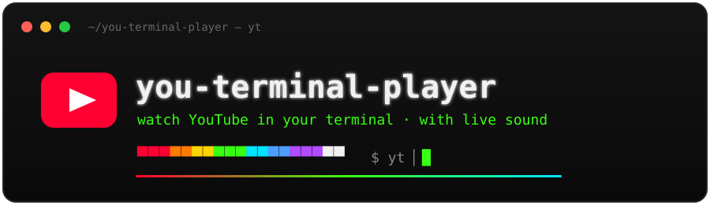

<p align="center">
  
</p>

<p align="center">
  <a href="LICENSE"></a>
  
  
  
  <a href="https://peab-dev.github.io/you-terminal-player/"></a>
</p>

<p align="center">
  <strong>Watch YouTube in your terminal</strong> — video as colored half-blocks at full
  resolution and original frame rate, <strong>with live, synchronized sound</strong>. 📺🔊
</p>

<p align="center">📖 <a href="https://peab-dev.github.io/you-terminal-player/"><strong>Full documentation</strong></a></p>

## Quick start

```bash
git clone https://github.com/peab-dev/you-terminal-player.git
cd you-terminal-player
./install.sh
yt           # play the default video
```

`install.sh` is idempotent — it installs `ffmpeg`/`ffplay`, Node.js, the Python
venv, the `yt-dlp` + PO-token pieces, the bgutil Docker server, and a global `yt`
command on your `PATH`. Re-run it anytime.

> **Requires Docker Desktop** (for the PO-token server). Everything else is
> self-contained.

## Usage

```bash
yt                                         # default video
yt "https://www.youtube.com/watch?v=..."   # a specific video
yt --res 1080 "<url>"                       # higher resolution
yt --no-audio "<url>"                       # silent
yt --cookies-from-browser safari "<url>"    # if YouTube says "confirm you're not a bot"
```

**Controls:** `space` = pause/resume · `v` = display mode (classic → ASCII → b&w → 16-color digits → full-blocks → matrix) · `q` / `ESC` = quit
**Resize the window anytime** — the picture refits to fill it (aspect preserved, no stretching).
**Tip:** enlarge the window + shrink the font (`Cmd` `-`) for a sharper picture.

Uninstall with `./uninstall.sh`. See the
[docs](https://peab-dev.github.io/you-terminal-player/) for options, internals
and troubleshooting.

## License

MIT
